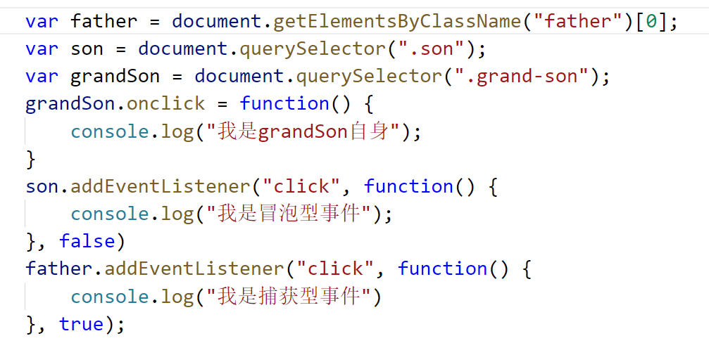
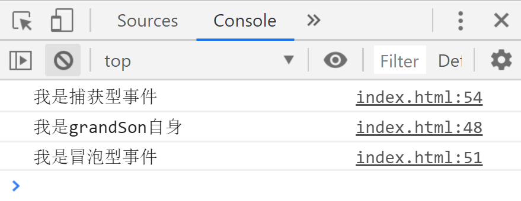
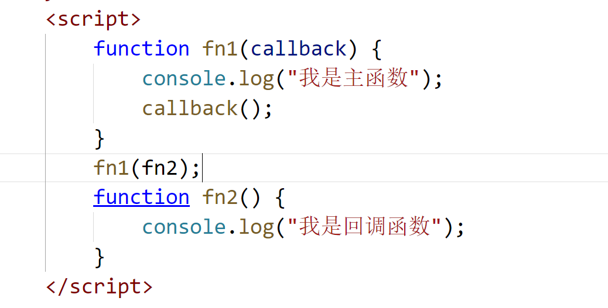
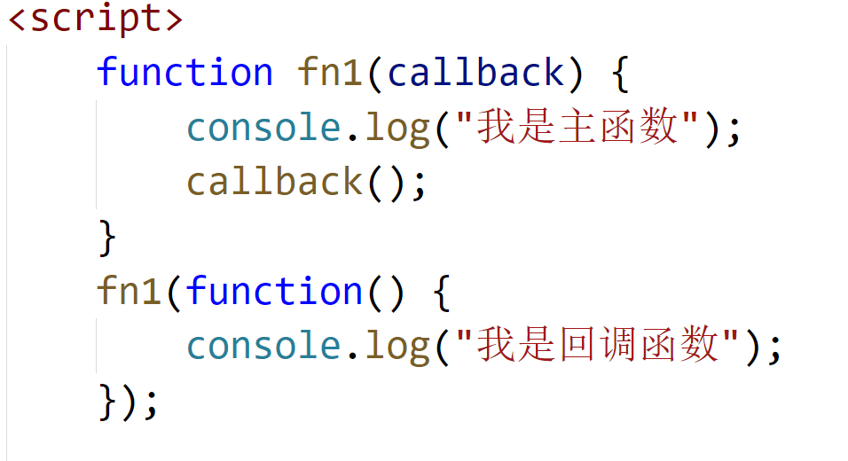
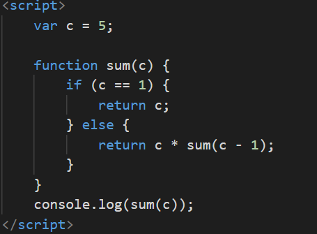

prompt("用户输入内容");
number(prompt("将字符串转为数字"););

# JavaScript
> JS是一种具有函数优先的轻量级解释型或及时编译型的编程语言

## JS文件的创建

* 修改文件后缀名(.js)
* 通过编辑器实时创建JS文件

## JS作用
* js是浏览器的脚本语言，需要依托于浏览器进行编写或展示
* 给HTML中的元素添加交互效果
* 进行游戏的开发
* 进行后台的开发

## js文件的引入

* 外部引入js
> <script src="js文件路径"></script>
* 内嵌式的js代码
> <script>js代码</script>
* 页面中重定向的地方
> <a href="js代码">
* 跟在事件之后
> <div class="box" onclick="js代码"></div>

## JavaScript组成部分

|名称|介绍|
|:----:|:----:|
|ECMAScript|定义了js的基础语法部分|
|BOM|浏览器对象模型，提供了用户与浏览器窗口交互的接口|
|DOM|文档对象模型，提供用于对HTML元素的操作的接口|

### ECMAScript
> 定义js的基础语法部分（需要了解ECMADcript的版本，有助于兼容性测试）

#### js的调试工具（输出工具）

* document.write（”内容“）
> 在页面中写入一段内容
* console.log（内容）
> 在控制台输出一段内容
* alert（内容)
> 弹出具有一段提示内容的警示框

#### 变量
> 计算机本质上就是对各种数据的操作，但是我们不可以直接用数据去操作，我们需要有一个东西来存放他们--变量

* 什么是变量
> 变量是存储数据的容器

* 如何声明变量
 - 使用var关键字声明变量
```javascript
    //先声明后赋值
    var num;
    num=1;
    //声明变量的同时赋值
    var num=1;
    //一次性声明多个变量，用逗号隔开，然后赋值
    var num1,num2,num3;
    num1=1;
    num2=2;
    num3=3;
    //一次性声明多个变量的同时进行赋值，用逗号隔开
    var num1=1,num2=2,num3=3;
```

* 如果变量声明之后没有赋值，那么默认值是undefined

#### js数据类型
> 计算机可以操作各种不同的数据，比如数字、文字、图片等，这些数据都会对应不同的数据类型（将他们进行分类方便我们的处理）
> 在js中根据数据的存储位置不同分为初始数据类型、引用数据类型两大类
* 初始数据类型（保存在内存中的栈区）
> 在栈区中存储的是一些一经确定无法更改的数据
    number：数值型
    1. 整型（整数）
    2. 浮点型（小数）
    3. 在js中的最大值Number.MAX_value、最小值Number.MIN_VALUE;
    4. 正无穷 Infinity、负无穷 -Infinity
    5. 科学计数法：5e+100=5*10^100;
    string：字符串型
    1. 在js中使用引号包裹起来的就是字符串类型
    2. 单引号和双引号的功能没有区别，但是不能交叉使用，可以相互嵌套；单引号不能嵌套双引号，双引号不能嵌套单引号。
    3. 在字符串中不允许换行
    Boolean：布尔值
    1. true
    2. false
    3.(undefined,null，0，“”，NAN)，false在js中为假的数据，其余的都为真
    undefined：未定义
    1. 声明变量未赋值的时候，变量默认为undefined
    2. 使用var声明变量，在变量声明之前变量值为undefined（变量提升）
    null：空
    是一个占位符，一般用于声明变量后不知道变量是什么数据，可以使用null先占位
    Symbol:独一无二的值
* 引用数据类型（保存在内存中的堆区）
> object对象， array数组， function函数


#### 运算符
> 运算符可以帮助我们对数据进行各种运算

* 算数运算符（+ - * / % ++ -- **[求幂]）
> + 1.正常的加法运算
    运算规则：除字符串以外，数据进行加法运算会将非字符型转化成数值，不能转化结果为NaN
    (1)true转为1
    (2)false，null转为0
    (3)undefined转为0
    2.字符串拼接
    规则：任意数据类型与字符串相加都会变为拼接后的字符串；不能转化为数字，结束是 NaN
> - * /
运算规则：在运算时将字符串转化为数字，再相减
> %:求余数
> **：  求幂
> ++ --：自加自减1
   1. --、++在前先加再运算
   2. --、++在后现参与运算后自增
> 总结：
1. 除了加法运算，其余运算都会将非数值型转为数值型，不能转则为NaN
2. undefined与任意数据类型进行运算都为NAN
3. 任意的数据类型与自符串型相加，结果都为拼接后的字符串

* 赋值运算符
> = += -= %= *= /= **=
  
* 关系运算符（比较运算符）
> (> ,<, ==,>=,<=,!=,===,!==>)
  运算规则：在进行比较的时候将非数值类型转化为主旨类型，如无法转换则为false
  指通过规定的语句让程序代码有条件的按照一定的方式执行
  ！=和！==的区别，！=表示两侧值不相等为真，!==表示两侧的数据类型和值都不相等为真 如果值相同，类型不同为真 类型不同值相同为真

* 逻辑运算符
> 与&& 或|| 非！
    &&：运算符两侧都为真运算结果为右侧的值，有一边为假运算结果为假的值，都为假则为左值。
    ||:运算两侧只要有一为真，则为真的值，如果都为假，则为右侧的值；如果都为真，则为左侧的值。
    ！：取反，原来为真结果为假，原来为假结果为真

***短路原则，在与或运算中，左侧的表达式能够决定整个运算的真假性，不需要看右侧的表达式，这就是短路原则，一般用于参数默认值的设置等***
* 一元运算符
> new(实例化对象) delete(删除) -(负) +(正)

* 三元运算符
> 表达式？成立的值：不成立的值

* 特殊运算符
> （）用于提升运算的优先级
> ,用于分割


#### 数据类型的判断

> 使用typeof判断数据类型
> typeof 数据

* typeof 判断数据类型的结果
|数据|数据类型|
|unfriend|unfettered|
|null|object|
|number|number|
|string|string|
|Boolean|Boolean|
|NAN|number|
|array|object|
|function|function|
|object|object|

### 流程控制
> js代码默认情况下回是从上往下执行，如果我们需要根据我们不同的要求执行代码，就需要到流程控制

* 什么是流程控制？
> 指通过规定的语句让程序代码有条件的按照一定的方式执行

* 流程控制的组成部分

|组成|作用|
|:----:|:----:|
|顺序结构|代码正常执行的顺序|
|分支结构|根据不同的条件执行不同的代码|
|循环结构|当条件满足的时候重复的执行同一代码|

* 分支结构
    一、if分支
        1. 单路分支
        if（条件）{
            条件为真执行的代码
        }
        2. 双路分支
        if（条件）{
            条件为真执行的代码
        }else{
            条件为假执行的代码
        }
        3. 多路分支
        if（条件1）{
            条件1为真执行的代码
        }elseif（条件2）{
            条件1为假条件2为真执行的代码
        }...
        else{
            所有条件都为假执行代码
        }
        4. 嵌套分支
        if(条件1){
            if(条件2){
                条件1，2都为真执行的代码
                if(条件3){
                    条件1，2，3都为真执行的代码
                }
            }
        }

    二、switch分支
    switch(判断的值){
        case num1:
            num与num1相等执行的代码;
            break;//终止后面的执行；
        case num2:
            num与num2相等执行的代码;
            break;//终止后面的执行；
            ......
        default:
            都不满足执行的代码;
            break;
    }
* if分支和switch分支的区别
> if分支主要用于判断范围，switch用于判断单个的值
> 判断的条件不能重复，否则会发生不可估量的错误

* 循环结构
> 在条件满足的情况下，重复执行某一段代码，这就是循环
    一、for循环
    1. 语法  for(初始值;终止值;步进值){
                循环体；
            }
    2. 循环步骤
    初始值=>终止值(满足条件)=>循环体=>步进值=>终止值判断（不满足条件）=>终止循环
    初始值=>终止值(不满足条件)=>终止循环
    3. 如果在循环过程中需要跳出循环或因为满足某个条件要终止整个循环，我们需要使用continue，break;
    continue跳出当前循环，如果下一次循环条件满足依旧会执行循环体
    break：终止整个循环，将不会再执行循环体，不论后面的条件是否满足
    二、while
    三、do_while循环


* for循环和while，do_while循环的区别
> for循环必须知道循环次数，while只需知道循环条件
> 优先使用for循环
> 如果无法写出确定的初试值，终止值，步进值，就选择while循环

* while和do_while的区别
> while先判断后执行循环体
> do_while先执行循环体后判断，所以无论条件是否满足do_while都会执行一次循环体

## js中的命名规范
* 必须以字母，$，下划线开头，其他可以为数字，字母，下划线和$
* 命名要有意义
* 不可以使用js中的关键字和保留字
* 驼峰命名法
> getElementById(小驼峰)
> NumberCeil(大驼峰)
* 在js中的一些命名习惯：首字母大写
* js严格区分大小写，也就是和nan和NAN完全不同

## 当我们大量要存储大量数据时
#### 什么是数组
> 数组是用于存储大量数据的容器

#### 数组的创建
* 实例化构造函数
> var arr=new Array();
* 隐式创建
> var arr=[];

#### 赋值方式
* 在创建数组的同时赋值
> var arr=new Array(1,2,3);
> var arr=[1,2,3];

* 在创建数组之后赋值
> 通过数组下标
```javascript
    var arr=[];
    a[0]=1;
    a[1]=2;
    a[2]=3;
```

* 下标
> 数组中存储的是有序的数据，每一条数据都对应有唯一的表示数据位置的内容，这就是下标

* 下标的特点
> 下标从0开始，每个下标都对应一个数据

* 赋值的特点
> 赋值时下标从0开始
> 数组中可以保存的数据是任意数据类型

#### 数组的访问
> 访问数组中的数据可以通过下标来访问
> 数组[下标]
* 访问的特点
> 数组的长度比数组中最大下标大一，也就是说想要访问数组中最后一个元素arr[arr.length-1]
> 访问的下标可以比数组中最大的下标大，但是相应的数据为undefined（还没有给这个下标定义值）

* 数组的长度
> 数组.length，数组中数据的个数

* 数组的遍历
> 通过循环将数组中的每一个数据否拿出来，这个过程就叫做遍历
* for循环遍历
> 将for循环的初始值设为0，终止值小于数组的长度，步进值为1，可以保证for循环中的变量从0开始，能够取到每一个，变量与数组的下标一致，一次来拿到数组中的数据。

### 二维数组
> 如果数组中的每一个数据都为一个数组，则为二维数组。

* 二位数组的遍历
> 通过两层循环，第一次循环遍历出数组的每一个数组，第二层循环将子数组进行遍历，拿到每一个数据。

#### 数组的解构赋值（ES6新增）
> 将数组中的每一个数据都拿出来赋值给变量，这个过程为解构赋值
> var [a,b,c]=[1,2,3];
> console.log(a,b,c); // 1 2 3

* 当变量的数量大于数组的长度时，多余的变量为undefined，这个值没有作用，需要给他个默认值
> var [a,b,c="asa"]=[1,2];
> console.log(a,b,c); // 1 2 asa

* 用处
> 不使用中间变量，将两个变量的值交换
> var a=1,b=2;
> var [a,b]=[b,a];
> console.log(a,b); //2 1

#### 扩展运算符（ES6新增）
> ...就是扩展运算符，可以将数组中的每一个数据都拿出来

#### 函数初级
> 封装有一段具有特定功能的代码段，就称为函数

#### 为什么使用函数
> 代码可以进行复用，一次声明，多次调用
> 可以给参数传递不同的参数，实现不同的功能
> 使代码更具有逻辑性，方便维护

#### 函数的创建方式

* 使用function关键字创建函数
> function 函数名（参数）{
    函数体
}

* 使用字面量函数创建（匿名函数）
> var 变量名=function（参数）{
    函数体
}

* 实例化function构造函数
> var 变量=new function("参数1,参数2,...","函数体")

#### 函数的调用
> 函数在创建后，函数体内的代码不会被执行，只有在我们调用时才会执行
* 使用function关键字和通过字面量方式创建的函数
> 函数名();
> 变量名();

* 函数自调用
> 严办用于匿名函数的调用，匿名函数可以使用变量来调用
> 自调用的函数只会被执行一次，所以只有我们确定函数只需要执行一次的时候在使用自调用
> 调用方法
```javascript  
    //第一种
    (function (){})()
    //第二种
    !function(){
    }()
    //第三种
    (function(){
    }())
```
* 通过事件调用
```html
    <button onclick='sun()'>
    点我吧！
    </button>
    <script>
    function sun(){
        alert("我是阳光");
    }
    </script>
```

***创建或调用函数需要注意的东西：1.使用function创建的函数，可以在创建前使用，但是使用字面量创建的函数不能再创建前使用；2.如果声明两个函数名相同的函数，后面的会覆盖前面的函数；3.不同的<script></script>代码中声明的变量或函数，在后面的script可以调用前面script中的变量函数，但是前面的script不能调用后面script中的函数***

#### 参数
> 参数是一个可变的量，在函数内部可以根据参数的不同实现不同的功能

* 形参
> 创建函数时写在小括号内的就叫形参

* 实参
> 函数调用时写在小括号内的就叫实参

* 参数接收类型
> 参数可以接收任意数据类型的数据

* 参数的数量
1. 当实参数量大于形参时
    * 在函数内通过argument对象可以找出所有的实参（包含了多余的实参）
    * 在函数参数部分最后通过rest参数来接收多余的实参
    > function (q,b,c,d,...rest){}
2. 当实参数量小于形参时
    > 多余的形参默认值为undefined
    > undefined对我们的函数运行没有任何意义，所以需要设置参数的默认值
    * ES5中设置参数默认值的方式
    > function(a,b){
        a=a||1;
        b=b||2;
        document.write(a+b);
    }
    * ES6中设置参数默认值的方式
    > function sun(a,b=1){}

#### 函数的返回值
> 函数体内部的代码运算结果，如果需要在函数外部进行调用，需要使用返回值（return）

* 返回值的添加
> 使用return语句，将运算结果返回给函数，使函数的结果变得有意义
> 如果没有人为的添加返回值，那么函数的返回值默认为undefined

* 返回值的作用
> 将运算结果返回给函数
> 停止并跳出当前函数 （不会执行return后面的语句）

***一个函数可以有多个return语句，但是只会有一个生效***

* 返回值的注意事项
> 返回值可以使任意类型的数据
> 每个函数都默认有返回值，如果没有人为的添加返回值，那么函数的返回值默认为undefined
> 一个函数有且只有一个返回值，在return语句后面通过逗号隔开的返回值最终只有最后那个生效（如果有多个返回值主要返回，可以将他们放在一个数组或对象中

### 对象
> 在js中是一种引用数据类型，他是一种复合值，将原始值或其他的对象保存在内部，我们可以通过他们的名字（属性）来访问这些值。简称为“属性的无序集合


#### 对象的组成
> 对象由属性和方法组成。一个属性存储的是原始值，也可以是引用值。若一个属性的值是函数，这种情况下属性也被称为方法。

|名称|作用|
|:----:|:----:|
|属性|描述对象的特征|
|方法|描述对象的方法|

#### 对象的创建
* 隐式创建
> json格式对象，json是一种轻量级的数据交换格式。
> {属性：属性值}

```javascript
    var obj={
        属性：属性值
    }
```
* 实例化Object构造函数
```javascript
    var obj=new Object();
    obj.name="asa"
```

* 实例化自定义构造函数
```javascript
    function Person(){
        this.name="zhao";
        this.age=18;
        this.sex="男";
        this.say=function(){
            document.write("你好！");
        }
    }
    var per=new Person();
    per.say();
    document.write(per.name);
```
* 实例化类
```javascript
    class Person{

    }
    var per=new Person();
    console.log(per);
```

#### 对象的访问
* 访问属性
> 对象.属性名
> 对象['属性名']
* 访问方法
> 对象.方法名();
> 对象['方法名']

#### 对象的增删改查
* 增
    1. 先创件对象，后赋值var obj={};
    obj.属性名=属性值;
    obj['属性名']=属性值;
    2. 创建对象的同时赋值
    var obj={
        属性：属性值;
    }

* 查
    1. 查看属性
    对象.属性名
    对象['属性名']
    2. 查看方法
    对象.方法名();
    对象['方法名']();

* 改
    对象.属性名=新的属性值;
    对象['属性名']=新的属性值;
    对象.方法名=新的方法;
    对象['方法名']=新的方法;

* 删
    1. 销毁对象
    对象=null
    2. 删除对象中某个属性或方法
    delete 对象.属性名
    delete 对象.方法名

#### 对象的遍历
> 通过循环将对象中的方法都获取到，就叫对象的遍历

> 语法：for(var i in 对象(obj)){
    obj[i]
}
***当对象的属性或方法名称保存在一个变量的时候，义序使用中括号访问:对象[变量]***

## DOM
> DOM是Document Object Model（文档对象模型）的缩写,用来呈现以及与任意HTML或XML交互

### dom中常用的属性和方法
#### 属性
|名称|作用|读写|
|:----:|:----:|
|URL|获取网页地址|只读|
|charset|获取网页的字符集|只读|
|tittle}获取网页的标题|读写|
|forms|获取页面中所有的表单元素|只读|
|images|获取页面中所有img元素|只读|
|body|获取body元素|只读|
|head|获取head元素|只读|
|documentElement|获取HTML元素|只读|
|cookie|网页的Cookie值，是一个字符串|读写|

#### dom常用的方法
|名称|作用|返回性|兼容性|
|:----:|:----:|:----:|:----:|
|document.write();|动态向页面写入内容|undefined|>=IE6,Chrome,Firefox|
|document.getElementsByTagName("tagName")|通过标签名获取DOM元素|类数组|>=IE6,Chrome,Firefox|
|document.getElementsByClassName("class")|通过类名获取DOM元素|类数组|>=IE8,Chrome,Firefox|
|document.getElementById("id")|通过id获取DOM元素|DOM对象|>=IE6,Chrome,Firefox|
|document.getElementsByName("name")|通过name属性获取DOM元素|类数组|>=IE6,Chrome,Firefox|
|document.querySelector("css选择器")|通过css选择器获取DOM元素|DOM对象|>=IE8,Chrome,Firefox|
|document.querySelectorAll("css选择器")|通过name属性获取DOM元素|类数组|>=IE8,Chrome,Firefox|

**方法的前面不仅能是document，还可以是任意的dom对象**

### 操作dom对象的内容
|名称|作用|特点|
|:----:|:----:|:----:|
|对象.innerHTML|获取或修改dom元素的内容|识别标签，保留文本格式|
|对象.innerText|获取或修改dom元素的文本内容|只识别纯文本，不保留文本格式|
|对象.textContent|获取或修改dom元素的文本内容|只识别纯文本，保留文本格式|

### 操作dom元素的样式
#### 操作dom样式的类名
* 对象.className
> 通过className属性可以获取和修改元素的类名
**如果想在原来类名的基础上添加类名，需要使用+=，并且新类名前面不许带空格**
> 对象.className+= ' 新的类名';

* 对象.id
* 使用classList属性 
//IE11以下不支持add等拥有多个参数
|方法|作用|
|:----:|:----:|
|对象.classList.add(类名1，类名2...)|给dom添加一个或多个类名|
|对象.classList.remove(类名1，类名2...)|给dom删除一个或多个类名|
|对象.classList.contains(类名1)|判断一个类名是否存在|
|对象.classList.toggle(类名1,类名2...)|如果类名已存在就删除,如果类名不存在则添加|
|对象.classList.replace(旧类名,新类名)|新类名替换制定旧类名|

#### 操作元素的行内样式

* 对象.style.样式名="样式值";
> 上面设置多个样式比较繁琐，可以用下面的方法，这个方法中的字符串方法与css样式没有区别，需要链子符的地方还需要

* 对象.style.cssText="样式组成的字符串";
**但是字符串中不允许换行，导致在书写的时候容易混乱，而且在字符串中加减乘除等运算，以及变量的引入字符串拼接，过于繁琐。需要使用ES6模板`字符串`**

* 获取元素的行内样式以及外部引入样式
> window.getComputedStyle(对象).样式属性

#### 操作元素的属性
* 元素本身自带的属性
> 对象.属性名
> 对象.id
> 对象.className
> input.name
* 自定义属性
> 很多时候元素自带的元素无法满足我们的需求，就需要自定义一些属性
|方法|作用|
|:----:|:----:|
|对象.setAttribute(属性名,属性值)|设置属性|
|对象.getAttribute(属性名)|获取属性|
|对象.removeAttribute(属性名)|删除属性|
|对象.hasAttribute(属性名)|判断是否有哪个属性|

### dom节点

* dom文档树

#### dom节点的组成
* 元素节点：html元素
* 属性节点：html属性
* 文本节点：html文本（包括空格）
* 注释节点：html注释
* 文档节点：整个html

#### 节点的详细信息
> 通过节点的属性来获取节点相关的所有信息，包括节点的名称、节点的类型、节点的值
|节点|节点类型|节点名称|节点的值|
|:----:|:----:|:----:|:----:|
|元素节点|1|标签名|null|
|属性节点|2|属性名|属性值|
|文本节点|3|#text|文本|
|注释节点|8|#comment|注释的内容|
|文档节点|9|#document|null|

* 获取节点的类型
> 节点.nodyType
* 获取节点的名称
> 节点.nodeName
* 获取节点的值
> 节点.nodeValue

#### 元素位置尺寸
* 元素的偏移量
|属性|作用|
|:----:|:----:|
|offsetWidth|元素内容(content)+左右内边距(padding)+边框(border)(不包括外边距)|
|offsetHeight|元素内容(content)+上下内边距(padding)+边框(border)(不包括外边距)|
|offsetLeft|表示该元素的左上角距离最近的具有定位属性的父元素的左上角的水平距离|
|offsetTop|表示该元素的左上角距离最近的具有定位属性的父元素的左上角的垂直距离|
|offsetParent|表示距离该元素最近的具有定位属性的父元素|

* 元素的大小以及相对于窗口的位置
> var object = element.getBoundingClientRect();
> 这个方法返回的是一个对象，对象中有以下属性
|属性|描述|
|:----:|:----:|
|bottom|元素的底边距离视口顶部的距离|
|height|元素的高度|
|width|元素的宽度|
|top|元素的上边距离视口顶部的距离|
|left|元素的左边距离视口左边距的距离|
|right|元素的有边距离视口左边距的距离|
|x/y|元素左上角距离视口|

* 获取具有滚动条元素的位置属性
	分类
		对象.scrollTop
			具有滚动条的元素在滚动的时候，他的内部元素超出该元素顶部距离
		对象.scrollLeft	
			具有滚动条的元素在滚动的时候，他的内部元素超出该元素左边距离
	用法案例
		子元素超出父元素  显示滚动条
			father.style.overflow="auto";


* 元素的内尺寸
> 元素.clientWidth：表示元素的内尺寸：元素内容(content)+内边距(padding)
> 元素.clientHeight：除了边框外的元素高度
> 元素.clientTop/clientLeft:表示元素的上边框和左边框大小：元素内容(border)

* 窗口左上角距离屏幕左上角的距离
> window.screenX
> window.screenY


### 事件高级
> 在JS中时一时间为驱动的，也导致在添加事件的时候可能会遇到一些问题，比如需要给同一个事件添加不同的事件处理程序的时候，如页面拖拽，事件触发的顺序等就需要是要事件高级。

#### 事件监听
> 给同一个递减添加多个事件处理

```javascript
    var box=document.querySelector('.box');
    //添加事件监听
    box.addEventListener("事件",回调函数,Boolean);
    box.addEventListener("click",function(){
        //事件触发要执行的代码
    },false);
```

* 移除事件监听
> 因为函数在内存中存储的位置不同，所以想要移除事件监听，那么被移除的事件处理程序必须是具名函数
```javascript
    var box=document.querySelector('.box');
    //添加事件监听
    function aaa(){
        //事件触发要执行的代码
    }
    box.addEventListener("事件",回调函数,Boolean);
    //移除事件aaa的事件监听
    box.addEventListener("click",aaa,false);
```

#### 事件对象
> 当事件在被触发的时候会有很多信息，保存在了事件对象中
* 获取事件对象
> 默认情况下，事件处理函数的第一个参数就是事件对象
> 但是低版本的浏览器中可能不支持这种语法，所以可以使用event对象

```javascript
    box.onclick=function(e){
        //兼容性写法
        //事件对象保存在ev变量
        var ev=e||event;
    }
```
#### 事件流
> 事件发生时会在元素节点与根节点之间按照特定的顺序传播，路径所经过的所有节点都会收到该事件，这个传播过程即DOM事件流。

* 事件的分类
1.冒泡型事件流：从最明确的事件源到最不明确的事件源
2.捕获型事件流：从最不明确的事件源到最明确的事件源


* 事件触发时所经历的阶段
1.事件捕获阶段(先捕获) true
2.事件自身阶段(后自身)
3.事件冒泡阶段(再冒泡) false






#### 事件委派
> 给多个元素添加同一事件及处理程序的时候，可以给他们的父元素添加这个事件，根据事件对象中target属性确定事件源，以此来实现事件添加

### 作用域
> 一段代码起作用的范围
* 全局作用域
> 在整个页面中任何地方都可以访问到的代码就拥有全局作用域

1.在函数外声明的变量拥有全局作用域
2.window对象是属性和方法也具有全局作用域

* 局部作用域
> 只在函数内部起作用的变量或函数就拥有局部作用域

### 作用域链
> 访问变量或函数时，会从当前作用域开时寻找，如果当前作用域没有，会去更高一级作用域中寻找，以此类推找到全局环境，这个过程形成的链条就叫作用域链。
***如果在全局作用域中依旧没有找到访问的变量或函数，会导致错误产生：变量未找到=>变量 is not defined;函数未找到=>函数 is not a function***

### 环境
> 运行环境是js的重要概念：表示的是js代码的执行的地方
* 宿主环境：指的是js运行的平台或软件，一般指浏览器

* 执行环境：定义了js中变量或函数能被访问的地方（由此产生了作用域）
1.全局环境：整个页面就是一个全局环境
2.函数环境：一个函数就是一个函数环境

***因为有环境的存在，所以产生了作用域：声明在全局环境中变量或函数拥有全局作用域；声明在函数环境中的变量或函数拥有局部作用域***

### 预解析
> JS解析器在运行js代码时，会将var声明的变量和function声明的函数提升到当前作用域的最顶端，在顺序执行

* js代码解析的顺序
1.按照<script></script>代码块解析
2.按照执行环境解析
全局环境：页面打开时解析
函数环境：函数调用时解析函数
3.遇到var和function关键字会将他们提前解析到内存中，这是变量提升的原因以及函数在创建之前就可以调用的原因
4.如果还有<script></script>代码块，继续按照前面的规则来解析


### 函数高级
> 在代码编写过程中经常会遇到必须在一个执行完成以后再执行另一个操作，js为我们提供了回调函数的方法

* 什么是回调函数
> 将一个函数的指针作为另一个函数的参数，并且在调用这个函数的时候就称为回调函数
* 回调函数的语法
> 传入指针
;

> 将函数整体出入进去
;
> 判断回调函数确实接收的是一函数
;

#### 递归函数
> 所谓递归函数就是在函数体内部调用函数本身

>实现任意数字的接触
;
***递归函数的使用需要谨慎，稍不注意就会写陷入死循环，获益使用递归函数必须要有终止条件***

#### 闭包
* 在函数外部有权访问函数内部的变量，这个函数就是闭包函数
* 常见的闭包函数形式
> 一般的闭包都是在函数内部返回一个新的函数，在新的函数内返回内部的变量

* 闭包的优缺点
优点：
    1.防止参数和变量被垃圾回收机制回收
    2.可以将函数内部的变量给外部使用
    3.函数嵌套函数（特点）
    3.可以减少变量名的冲突
缺点：
    1.即使不适用这个函数，函数也会一致保存在内存中，导致大量内存的浪费
    2.使用不当会导致内存的泄漏（尤其体现在IE浏览器中）

* 什么时候使用闭包
1.希望一个局部变量长期驻扎在内存中
2.避免全局变量的污染
3.私有成员的存在

### 对象高级

#### es6新语法
* 简写方式
> 当对象属性值保存在与属性名相同的变量中时，可以简写成一个
```javascript
    let name = "张三"
    let obj = {
    //name:name; 可以简写为
    name,     
    age: 20
    }
```
* 对象的解构赋值
> 将对象中的属性值按照属性名一一赋值给变量名
```javascript
    var an={
    name = "张三",
     age =12;
     }
    var {name,age} = an;
```

* 对象rest值
> ES6新增的...扩展运算符可以用于对象，接收对象中的属性
```javascript
    var an={
    name = "张三",
     age =12;
     }
    var {name,...rest} = an;
```
### 对象的特性
#### 封装
> 将对象的创建以及赋值等过程组合在一起，把函数内的细节都隐藏起来，只提供接口供外界访问，就叫封装
* 工厂函数封装(不推荐使用)
> 将实现一个对象的整个过程放在一个函数中，并且将这个对象作为函数的返回值
```javascript
    function stu() {
            var student = {};
            student.name = "赵哥";
            student.age = "男";
            student.say = function() {
                console.log("say");
            };
            // console.log(student);
            return student;
        }
        console.log(stu());
        var a = stu();
        var b = stu();
        console.log(a, b);
```

* 构造函数的封装

```javascript
    function Ani(name, age, sex) {
            this.name = name;
            this.age = age;
            this.sex = sex;
            // this.say = () => {
            //         console.log('呜呜呜' + say);
            //     }
            // this.eat = (foot) => {
            //     console.log("我吃" + foot);
            // }
        }
        //
        Ani.prototype.say = (say) => {
            console.log('呜呜呜' + say);
        }
        Ani.prototype.eat = (foot) => {
            console.log("我吃" + foot);
        }
        var dog = new Ani("狗", 3, "公", "你好");
        dog.eat("骨头");
        console.log(dog);
```

***通过构造函数创建出来的对象，会将狗仔函数中所有的属性好方法都在内存中重新创建一次，一些公共的属性好方法也会，造成资源的浪费***

* 因为上面的原因，诞生原型概念
> 所谓原型就是函数或对象的一个属性，这个属性保存的是一个对象
> 作用：对象的公共属性和方法，减少内存空间的浪费
**通常情况下，使用构造函数与原型相结合的方式来进行对象的封装；公共属性放在原型，私有属性放在构造函数中**


>在上面的案例中，我们可以看到在dog对象身上并没有eat方法，但是却可以调用，是因为eat方法保存在了原型中，可以进行调用

#### 对象的特性------继承
> 就是在一个对象的基础上创建另一个对象，新对象可以访问源对象的属性或方法
**实现继承方法**

* 原型继承
> 在子类的原型中保存父类的实例，也就是将父对象保存在子对象的原型中
```javascript
    function Farher(name) {
            this.name = console.log("father");
        }
        function Son() {
            console.log("son");
        }
        Son.prototype = new Farher();
        var so = new Son();
        console.log(so);
```
* 通过改变this的指向实现继承
    1.call
    2.apply
    3.bind

***__proto__是对象是原型：内部的constructor实行指向构造函数（表示当前对象有哪一个构造函数实例化而来***

***this:在事件中有谁触发this就指向谁，普通函数中：函数由谁调用，this就指向谁***

***constructor内写属性，外面写方法***

* 原型链
在访问对象的属性或方法的时候，首先从对象自身寻找，如果没有就去对象的构造函数中寻找，如果构造函数没有，就去构造函数的原型中寻找，如果构造函数的原型中也没有就去原型的构造函数中去寻找，如果也没有，就去原型的构造函数的原型中寻找，以此类推直到找到object，null，如果都没有访问的属性会返回undefined，方法会报错。

### class类
> 在ES6之前没有过的概念，只有类似的构造函数，为了使js更加趋近于面向对象的编程，在es6中添加了类的概念，类其实就是一个创建对象的模板

* 创建一个类
```javascript
    class 类名{
        constructor(){
            //存放属性
        }
        //存放方法
    }
```
* 类的继承
> 在es5中通过原型继承，在es6中通过extents继承
```javascript
    class 子类名 extents 父类{
        constructor(){
            super();
            //在子类中调用super方法，可以真正实现继承
        }
    }
```

## 原生对象
> 数组对象、字符串对象、数学对象、日期对象、正则对象、object对象

## JS异步
### AJAX
> ajax是一种用于快速创建动态网页的技术

### ajax工作原理
> ajax其实是在客户端和服务器之间搭建了一个中间层，用户在客户端发起的请求有ajax代为发送，ajsx发动给服务器，服务器响应之后返回向ajax，ajax接收到响应进行处理，处理完成后将数据渲染到页面中。

#### Ajax获取数据五部曲
1. 实例化XMLHttpRequest对象 var myAjax = new XMLHttpRequest();
2. 使用open方法开启与服务器的通信 myAjax.open("get","地址",true)
myAjax.open("请求方式","请求URL",Boolean);
    请求方式：get和post
    Boolean：表示请求是否支持异步，true支持，false不支持
3. 发送请求，使用send方法 myAjax.send(null);
    如果为git请求可以传null或不传（因为get请求的参数会跟URL地址的后面）
    post请求：send中传参，但是参数必须是字符串，post必须设置请求头（头信息）
4. 添加onreadystatechange事件，监听请求状态的改变，确定请求是否成功或完全解析
    判断ajax对象中readyState是否为4
    判断ajax对象中status是否为200
5. 渲染数据
    通过字符串拼接将我们得到的数据放置在HTML中，使用innerHTML属性
    
  myAjax.onreadystatechange=()=>{
    //必须要判断本地的请求状态是成功的，并且服务器的响应也是成功的，然后才能对请求的内容进行操作
    {
        //请求过来的数据在ajax对象中的response属性中进行保存

        //所有的响应都完成，所有的数据都进行处理之后将内容展示在页面中
        //获取所有需要的HTML的所有数据拼接成一个字符串

        //在所有商品HTML拼接好后，将内容写到页面中，因为字符串有标签，所以需要使用innerHTML属性进行添加
    }
}

## 本地存储
> 项目开发过程中会有一些数据需要保存在用户浏览器中，比如记住密码、一些用户的独特id、token等。一般保存在用户本地存储中
**js中本地存储有三种方式：cookie，localStorage,sessionStroage**
### 三者的区别
* cookie
    1.cookie的使用需要服务器环境
    2.cookie存储少量数据，不能超过4k的数据，一个网页最多存20条
    3.cookie只会在有效期前存在，之后就会删除
* localstorage
    1.存储数据量大大增加，在5~10M之间
    2.已经存储只要不人为删除，永久存在
* sessionStroage
    1.存储数据量大大增加，在5~10M之间
    2.属于会话型存储，在访问的页面关闭以后就会被删除

# JS单线程异步机制
***在JS中JS代码的执行只有一个线程，但是在执行代码的过程中有一些代码需要一定是触发条件才能执行，这个时候就必须等待这段代码触发这行后才能继续执行后面的代码，这样挥发藕汁JS代码执行的很慢，JS解决这个问题***

### 异步
**因为JS的单线程机制，所以JS所有的代码都需要按照顺序去执行，（都排列在一条线中）当遇到触发条件才执行的代码时，JS不会等待条件触发，会先去执行后面的代码，当触发条件满足时，会先将当前正在执行的操作结束，然后将需要触发条件的代码插入到序列中执行**

## 异步的是吸纳方式
### 回调函数实现异步操作
> 回调函数就是在一段代执行结束后再执行另一端diamante，这个与异步的概念向吻合，所以使用回调函数解决异步是常用的方法
### 观察/订阅者模式
> 使用自定义函数帮助我们监听一段代码的执行，也就是说添加了一个观察者元，实时监测异步代码的执行，当异步操作需要开始的时候，观察者就告诉我们。

### promise对象
> promise对象其实就是一个异步的封装，内部封装了一个在未来某一个时间会执行的函数（resolve），而且是异步操作
* promise对象的参数
> 有两个参数，第一个是resolve，第二个是reject，分别表示当异步操作成功时要执行的回调函数，异步操作失败时要执行的回调函数
* promise中的属性和方法
1. 方法
（1）promise对象.then(异步操作成功时执行的回调函数)
promise.then(function(res)){
    //res是异步操作成功时的返回值
}
(2)promise对象.catch(异步操作失败时执行的回调函数)
promise.catch(function(res)){
    //res是异步操作失败时的提示信息
}
(3)promise.resolve();创建一个异步操作成功的回调函数
(4)promise.all([promise1,promise2,...]);这个方法可以将多个promise对象封装到一个promise对象中，同时拿到他们所有的执行结果

### generator


### async,await


@keyframe move{
    
}


深拷贝，浅拷贝

下载 swioer,echarts,animate.css


stopPropadation();
清除跳转
<a href="#"></a>//点击页面刷新
<a href="javascript:;"></a>  //最常用的方法
<a href="javascript:void(0);"></a>
<a href="javascript:fn();"></a>


//页面加载完成以后执行代码
window.onload=function(){}

// 模板字符串
cssText ``;//允许换行（回车）
`${5+6}px`

coding
get clone 地址
get add . 
det commit -m '名字'
get pull获取
get push上传

calc();

console.dir(document);//查看dom属性好方法
linear-gradient 线性渐变
radial-gradient 径向渐变
text-shadow:;阴影


字面量
垃圾回收
